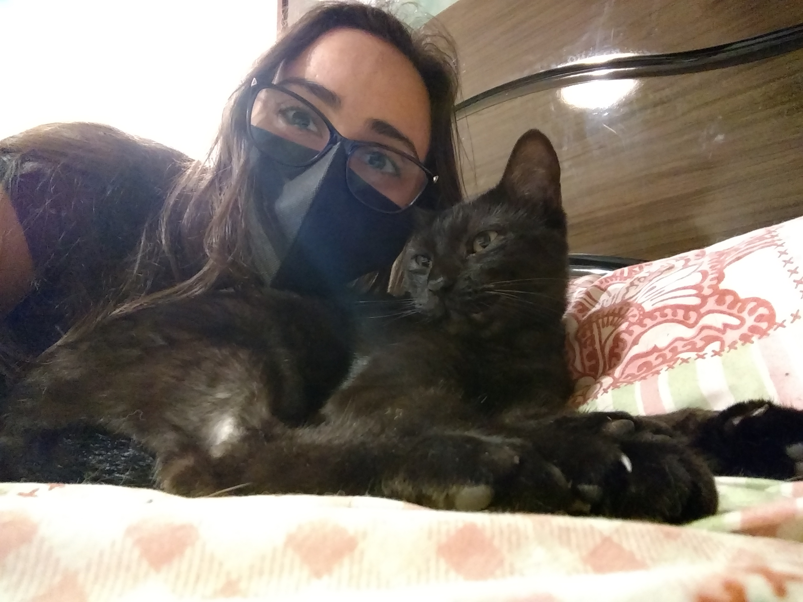

# Debora Almeida
## FullStack Dev
## UX Designer

---------------------

### Sobre mim

Nascida em Petrópolis - RJ no ano de 1989, vivo hoje em Rio das Ostras, uma cidadezinha no litoral do estado. Minha família é um misto de seres humanos, cães e gatos. Amo praia e por do sol, meditação, esportes e arte de uma forma geral. Meus hobbies são pole dance e piano.  

Sou apaixonada por tecnologia e desafios! Gosto de me conectar com pessoas e entendê-las. O que me inspira é a maneira única que cada um tem de enxergar e experimentar o mundo.

Conheci programação em 2020 numa aula da faculdade, na época em que cursava engenharia. Me encantei e logo comecei a estudar, fazendo cursos livres de JavaScript, HTML e CSS. Conheci o termo "experiência do usuário" durante os estudos de Front-end e logo percebi que estava totalmente envolvida com isso também, unindo os conceitos e técnicas de uma área com a outra. 

Com a correria do dia-a-dia, pratiquei pouco durante esses primeiros anos. Agora, mais organizada financeiramente, finalmente tenho tempo para me dedicar aos estudos e me aprofundar em programação e UX. Quero trabalahar com o que realmente gosto e busco migrar para a área de tecnologia que tanto me desafia e me move a querer sempre ir mais longe!

